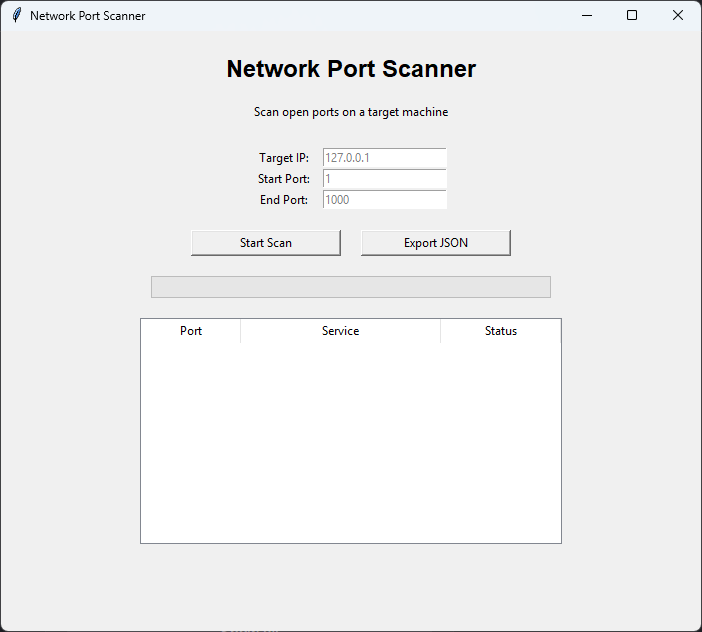

<h1 align="center">
  🛡️ Network Port Scanner Pro
</h1>

<p align="center">
  
  
  
  
  
</p>

<p align="center">
A multi-threaded Python GUI port scanner that detects open TCP ports, identifies services, and exports results to JSON.
</p>

---

## 🖥️ Preview

<p align="center">
  
</p>

---

## 🚀 Features

- 🖥️ Tkinter-based graphical interface  
- ⚡ Multi-threaded port scanning for speed  
- 🔍 Detects open TCP ports  
- 🧠 Maps ports to known services (SSH, HTTP, FTP, etc.)  
- 📊 Real-time progress tracking  
- 📋 Interactive results table (Treeview)  
- ⚠️ Input validation and error handling  
- 💾 Export scan results to JSON  

---

## 🧱 Project Structure

```text
network-port-scanner/
│
├── gui.py           # GUI application (Tkinter interface)
├── main.py          # Entry point (launches app)
├── scanner.py       # Core scanning engine (threaded logic)
├── utils.py         # Helper functions
├── services.py      # Port → service mapping
│
├── requirements.txt
└── README.md
```

---

## 🧠 About This Project
This project was built to demonstrate:

* Networking fundamentals using Python sockets
* Multi-threading for performance optimization
* GUI development using Tkinter
* Clean modular code structure
* Real-world tool design (security / network utilities style applications)

---

## 🖥️ How It Works

1. User enters:
   - Target IP address
   - Start port
   - End port

2. The scanner:
   - Uses multiple threads for fast scanning
   - Attempts TCP connection on each port
   - Detects if the port is open
   - Maps open ports to known services

3. Results are:
   - Displayed in a GUI table
   - Updated in real time via progress bar
   - Stored for optional JSON export

---

## ▶️ How to Run

### 1. Clone the repository

```bash
git clone https://github.com/yourusername/network-port-scanner.git
cd network-port-scanner
```

### 2. Run the application
   
```bash
python main.py
```

## 📦 Example Output (JSON Export)
```json
{
  "results": [
    {
      "port": 22,
      "service": "SSH",
      "status": "OPEN"
    },
    {
      "port": 80,
      "service": "HTTP",
      "status": "OPEN"
    }
  ]
}
```

---

## 📈 Future Improvements
* Async scanning (faster than threads)
* Dark mode UI toggle
* Banner grabbing (service version detection)
* CSV / HTML export support
* Subnet scanning support

---

## ⚠️ Disclaimer

This tool is intended for educational purposes and authorized network testing only.
Do not scan networks or devices without permission.
